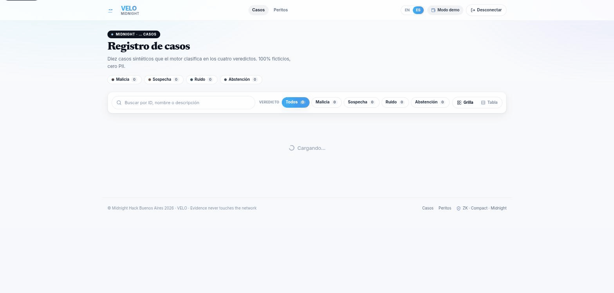

<div align="center">


</div>

# VELO

> **El veredicto se ve, la víctima no.**

<div align="center">

## ▶ [Abrí el VELO Hub — todo el proyecto en una página](https://velo-hub-zeta.vercel.app/)

[](https://velo-hub-zeta.vercel.app/)

</div>

Atestación de veredictos forenses con conocimiento cero sobre [Midnight](https://midnight.network).
Un perito puede probar que su veredicto es legítimo **sin publicar nunca la
evidencia de la que salió**.

`Apache-2.0` · `TypeScript + Compact` · Construido sobre Midnight

📄 **[English README](./README.md)** — versión completa, con diagramas, la API y las
instrucciones de deploy.

⚡ **[Inicio rápido (EN/ES)](./docs/QUICKSTART.md)** — instalación para copiar y pegar,
los 14 casos de a uno, las demos, y cada script adversarial con qué prueba.

🔗 **[Verificalo en el explorer de Midnight](https://preview.midnightexplorer.com/contracts/0x46cac58c4eb0e034b4211d754bfe67f7e8e1aa08d448ebd089437ed573023d9d)** — el contrato desplegado y sus
atestaciones en un explorador de bloques que no controlamos. Sin instalar nada.

**Demo en vivo: [velo-1028999311218.us-central1.run.app](https://velo-1028999311218.us-central1.run.app)** — leyendo el contrato real desplegado en Midnight preview. Sin wallet, claves ni instalación para navegarla.

**Video demo: [youtu.be/AHBEUcrzf48](https://youtu.be/AHBEUcrzf48)** — un recorrido del flujo, de punta a punta.



## Explorar

Cada página es bilingüe (EN/ES).

- **[App en vivo](https://velo-1028999311218.us-central1.run.app)** — el frontend corriendo en Google Cloud Run, leyendo el ledger real on-chain.
- **[Pitch deck](https://annatchijova.github.io/vigia/velo-pitch-deck.html)** — el deck de slides bilingüe.
- **[Diagrama de arquitectura](https://annatchijova.github.io/vigia/veloarchitecture-diagram.html)** — la vista de una imagen: "un lado prueba, el otro queda sellado".
- **[Arquitectura](https://annatchijova.github.io/vigia/velo-architecture.html)** — el documento completo, desde [`docs/ARCHITECTURE.md`](./docs/ARCHITECTURE.md).
- **[Estado técnico](https://annatchijova.github.io/vigia/velotechnical-status.html)** — qué es real y qué está pendiente, capa por capa.
- **[Modelo de identidad](https://annatchijova.github.io/vigia/velo-identity.html)** — autorización de perito acreditado, no identificación biométrica.
- **[Caso de negocio](https://annatchijova.github.io/vigia/velo-business.html)** — la capa de reputación forense y sus casos de uso.
- **[Por qué el ZK es esencial](https://annatchijova.github.io/vigia/velo-sin-zk-no-hay-velo.html)** — por qué el zero-knowledge es estructural para VELO, no un feature opcional.
- **[Roadmap](https://annatchijova.github.io/vigia/velo-roadmap.html)** — las capas entregadas y lo que viene.

## Levantarlo localmente

No hacen falta secretos para ver la demo — la wallet y las claves solo importan para *atestar* (el write path), nunca para correr la UI ni leer la cadena.

```bash
git clone https://github.com/annatchijova/velo.git
cd velo

npm install        # workspaces de npm: instala el motor root + el frontend
npm run build      # compila dist/, que el frontend importa como `velo/*`

cd frontend
npm run dev        # http://localhost:3000
```

Requiere Node 20+. La primera carga compila on-demand, así que tarda unos
segundos — es Next.js buildeando, no está colgado.

---

## El problema

Hoy un perito forense tiene dos opciones, y las dos son malas:

1. **Publicar la evidencia cruda** para que otros puedan verificar el veredicto.
   La víctima queda expuesta ante todos los que no necesitaban verla.
2. **No publicar nada**, y pedirle al tribunal que confíe en su palabra.

Todo flujo de trabajo forense en producción elige una de las dos. VELO no elige
ninguna.

## En simple, paso a paso

1. **El perito tiene el caso en su computadora** — discos, logs, capturas.
   Nunca sale de ahí.
2. **Le pide a VELO que lo analice**, hablándole por MCP (el mismo protocolo
   que usan los agentes de IA para llamar herramientas) — el perito conecta
   su cliente y llama a `seal_case`. No hay formulario ni upload.
3. **Un motor matemático analiza la evidencia — no una IA.** Busca 5 tipos de
   señales de manipulación con reglas fijas, sin redondeo ni azar: los
   mismos datos siempre dan el mismo veredicto, en cualquier máquina.
4. **El motor exige que el perito se cuestione a sí mismo.** Si el resultado
   es el veredicto más grave (`MALICE`), el sistema lo degrada
   automáticamente a menos que el perito haya escrito un argumento en contra
   de su propio hallazgo.
5. **Todo se sella localmente** con una cadena de hashes — como un precinto
   que se rompe visiblemente si alguien lo toca después.
6. **Se genera una prueba de conocimiento cero (ZK)** de que se siguieron las
   reglas de admisibilidad, sin revelar una sola línea del caso.
7. **Solo esa prueba, un hash (el "commitment") y el veredicto se publican en
   Midnight.** La evidencia cruda jamás cruza esa línea.
8. **Cualquiera —un juez, la contraparte, el público— puede verificar** que
   el veredicto es real y que se siguieron las reglas, sin ver ni un archivo
   del caso.

Abajo está la versión técnica del mismo flujo, con el diagrama y las reglas
exactas que el circuito hace cumplir.

## Cómo


El perito corre un motor determinista en su propia máquina, sella el resultado, y
publica **solo un commitment y una prueba de conocimiento cero**. La prueba
establece dos cosas a la vez: que el veredicto publicado corresponde al análisis
sellado, y que se cumplió un criterio de admisibilidad formalizado, inspirado en el
estándar *Daubert* — *al menos dos fuentes, declaradas independientes por el
analista y distintas por raíz de cadena de proveniencia, para un veredicto*
`MALICE`.

Esa regla no es una nota de política ni una convención de code review. Es una
**restricción dentro del circuito**: una atestación que la viole no puede
producirse.

Lo confirmamos de forma adversarial contra el contrato deployado. Forzar un
veredicto `MALICE` con una sola fuente corroborante — enviado directo al
circuito, salteándose el motor y todos los chequeos de aplicación — es rechazado
por el assert del propio circuito:

```
failed assert: MALICE requires at least 2 independent corroborating sources — the Daubert gate
```

No se produce ninguna prueba, así que nada llega al ledger. La garantía es
criptográfica, no una promesa de nuestro código (`deploy/attest-forced-malice.ts`;
ver `docs/TECHNICAL_STATUS.md` §2.2).

La evidencia cruda nunca cruza el límite. Lo que cruza es un commitment, el
veredicto declarado, un timestamp y una prueba sobre ellos.

**Sin zero-knowledge, no hay VELO.** Sacá la prueba y las dos malas opciones
vuelven de una: publicar la evidencia y exponer a la víctima, o no publicar nada
y pedirle al tribunal que confíe. La prueba ZK es lo único que permite que el
veredicto sea público mientras la evidencia queda sellada — no es un feature
agregado al producto, *es* el producto.
([Por qué el ZK es esencial](https://annatchijova.github.io/vigia/velo-sin-zk-no-hay-velo.html).)

## Lo que lo hace real: el sistema se niega

Cualquiera puede construir algo que diga que sí. Lo interesante es **cómo se
niega**. `npm run simulate` demuestra las dos negativas en vivo:

**Negativa 1 — no hay fuentes independientes suficientes.** Evidencia que
alcanzaría para `MALICE`, pero toda rastreable a una sola adquisición:

```
[VEREDICTO INTENTADO] SUSPICION
[POR QUÉ] Score 0.3000 por encima del piso de ruido pero por debajo del umbral de MALICE.
```

**Negativa 2 — sin cadena de custodia.** Los *mismos* artefactos byte por byte,
quitando solo el registro de cómo se adquirieron:

```
[VEREDICTO CON CUSTODIA]     MALICE
[VEREDICTO SIN CUSTODIA]     ABSTAIN
```

Evidencia idéntica, resultado opuesto. La admisibilidad es una propiedad del
**proceso**, no de qué tan incriminatoria se ve la evidencia. Un hallazgo que nadie
puede rastrear hasta una adquisición legal no es un hallazgo más débil: es uno
inadmisible.

## Probalo

Paso a paso, en una máquina nueva: **[docs/QUICKSTART.md](./docs/QUICKSTART.md)**.

```bash
npm install
npm test          # 115 tests del motor, incluidos los adversariales
cd frontend && npx vitest run   # 116 más — 231 entre las dos suites
npm run simulate  # historia completa, las dos negativas
```

El ciclo completo contra Midnight `preview` está en
**[`docs/CHAIN.md`](./docs/CHAIN.md)**: sellar local → atestar on-chain → leer
desde el ledger.

### Despliegue (Google Cloud Run)

La app está **viva en
[velo-1028999311218.us-central1.run.app](https://velo-1028999311218.us-central1.run.app)**,
desplegada como contenedor desde el `Dockerfile` de la raíz del repo
(multi-etapa: instalar → compilar el motor raíz → `next build` → `next start`
en el `$PORT` de Cloud Run):

```bash
gcloud run deploy velo --source . --region us-central1
```

Proyecto `vigia-497422`, `us-central1`, `--allow-unauthenticated`,
`min-instances 0` (escala a cero; unos segundos de cold start en el primer
request). El contexto de build es la **raíz del repo**: la imagen debe llevar
el `dist/` del paquete raíz, el corpus, `contracts/managed/` (los bindings
commiteados que `/api/chain` carga en cada request) y
`deploy/managed-shim/` (la dirección del contrato desplegado).

Las rutas del corpus (`/api/cases`, `/api/cases/:id`, `/api/peritos`) son
**estáticas en el build** (`force-static` + `generateStaticParams`), así el
runtime nunca lee el filesystem del repo para servirlas. Las lecturas de
cadena (`GET /api/chain`) corren en el contenedor con los bindings del
contrato commiteados — sin wallet, sin claves, sin costo. Las **escrituras**
de atestación nunca corren en la app hosteada; quedan en la máquina del perito
(`deploy/attest-case.ts`, ver [CHAIN](./docs/CHAIN.md)).

Por qué no Vercel: el builder `@vercel/next` falló de forma reproducible de su
lado (`ENOENT` en `export-detail.json` después de un `next build` exitoso); el
pivote está registrado en [`ADR-007`](./docs/ADRS_001_006.md).
`frontend/vercel.json` y la configuración relacionada quedan en el repo, sin
uso.

## Estado — qué es real y qué no

| Capa | Estado |
|---|---|
| Motor determinista + gate de Daubert | **Funciona**, 115 tests |
| Cobertura de tests entre las dos suites | **231 en verde** — 115 del motor (`npm test`) + 116 del frontend (`vitest run` en `frontend/`). Contados por los runners, no estimados — `node scripts/count-tests.mjs` vuelve a medir y falla si esta línea se desactualiza |
| Sellado local, cadena de custodia, hashing canónico | **Funciona** |
| Verificador offline sin dependencias | **Funciona** |
| Servidor MCP | **Funciona**, probado sobre JSON-RPC real |
| Contrato Compact | **Compila** — `compactc 0.31.1`, ambos circuitos, claves reales |
| Contrato desplegado | **Vivo en `preview`** — [`46cac58c…3d9d`](https://preview.midnightexplorer.com/contracts/0x46cac58c4eb0e034b4211d754bfe67f7e8e1aa08d448ebd089437ed573023d9d), verificable en el explorer |
| Atestación on-chain | **Funciona** vía CLI (`deploy/attest-case.ts`). **Dos atestaciones reales registradas**, ambas `MALICE` |
| Lectura del ledger | **Funciona** — `GET /api/chain`, MCP `chain_status` |
| Firma desde el navegador | **No construida** — ver Limitaciones |
| Red team | **6 rondas** — reportes completos RT1–RT6 abajo |

### O no nos creas nada

Los dos primeros chequeos corren código de este repositorio. El tercero no: es
un explorador de bloques de terceros que no controlamos, leyendo la misma
cadena pública.

```bash
npm test                            # el motor y el corpus
node scripts/verify-chain-read.mjs  # el ledger, sin billetera ni claves
```

**[preview.midnightexplorer.com/contracts/0x46cac58c…023d9d](https://preview.midnightexplorer.com/contracts/0x46cac58c4eb0e034b4211d754bfe67f7e8e1aa08d448ebd089437ed573023d9d)**

`DEPLOYED`, con la transacción de despliegue, el bloque en el que entró, y
`attest` como el punto de entrada que se llama.

---

## Limitaciones conocidas

Esta sección existe porque un sistema construido para no sobreafirmar tiene que
empezar por no sobreafirmar sobre sí mismo. Nada de lo que sigue es un bug abierto:
son **fronteras de lo que una prueba de conocimiento cero puede establecer**, y
están documentadas en detalle en las rondas de red team.

### Lo que el circuito no puede ver

**El binding de los witnesses a una corrida real del motor** *(G1, G3 — Ronda 2)*
El circuito prueba perfectamente las relaciones **entre** los witnesses que recibe:
que el veredicto está atado al fingerprint, que el conteo cumple el gate. Lo que no
puede ver es si esos witnesses describen **una corrida real del motor sobre
evidencia real**. Ese binding vive solo en el llamador (`src/witness/witnesses.ts`),
que es exactamente la parte que una prueba ZK no cubre.

En concreto: `corroborationCount` es un número que el prover provee. El circuito
verifica que sea `>= 2`, no que las dos fuentes sean *realmente* independientes —
eso se computa off-chain contando raíces de proveniencia distintas, y es **declarado
por el analista**, no probado criptográficamente.

Cerrarlo requiere un mecanismo de proveniencia de witnesses: firma del binario del
motor, credencial de perito acreditado, o attestation del entorno de ejecución. Es
diseño criptográfico real, no plomería.

**Esto no es una debilidad específica de VELO** — es lo que "prueba de conocimiento
cero" significa para *cualquier* sistema que atesta hechos del mundo real en vez de
computación pura. La respuesta correcta es la que se tomó acá: arreglar lo que se
arregla, y nombrar con precisión lo que no, para que nadie pueda decir que se
escondió.

### Lo que se filtra aunque la evidencia no

**Enlazabilidad por wallet** *(G5)*
Cada atestación es una transacción desde una wallet. Si un perito atesta siempre
desde la misma dirección, todos sus commitments son enlazables entre sí — sin
revelar ningún contenido de caso, pero sí su cantidad de casos, distribución de
veredictos y cadencia. Lo mitiga la credencial ZK anónima, que no está construida.

**Metadata del propio ledger** *(G4)*
El commitment, el veredicto y un timestamp **sí** salen, por diseño. Alguien
mirando la cadena aprende que existió una investigación, aproximadamente cuándo, y
su categoría de resultado — sin ver el caso.

### Lo que depende de que exista algo más

**Sin versionado de reglas** *(G7)* — El umbral de corroboración (`>= 2`) está
fijo en el circuito. Si cambiara, las atestaciones viejas no llevan marca de contra
qué regla se verificaron. Solo importa cuando exista una segunda versión del
contrato.

**Sin modelo de revocación** *(G8)* — Qué pasa si un perito pierde su matrícula.
No tiene sentido diseñarlo antes que la credencial que revocaría.

### Lo que el servidor no valida

**Parámetros que provienen de un agente** *(F15 — Ronda 3)*
Cuando un agente LLM construye la llamada a `seal_case`, el texto libre de la
evidencia entra en su contexto. Un intento de inyección de prompt fue **probado y
falló** — el agente lo reconoció y lo rechazó — pero esa defensa vino del juicio del
modelo, **no del servidor**. VELO no verifica que el `devilAdvocate` esté anclado a
la evidencia real. Un framing distinto, u otro modelo, podría dar otro resultado.

### Lo que no está construido

**Firma desde el navegador** — Hoy se atesta por CLI, firmando con una wallet
derivada de seed en la máquina del perito. Arquitectónicamente es el equivalente CLI
de la wallet del perito, pero **no** es la UI conectada a 1AM: `POST /api/attest`
sigue calculando un commitment local.

**Divulgación selectiva, credencial ZK del perito, segunda opinión ciega** — Están
diseñadas ([`docs/IDENTITY.md`](./docs/IDENTITY.md),
[`docs/ROADMAP.md`](./docs/ROADMAP.md)) y no implementadas.

### Y lo que explícitamente no resuelve

VELO **no impide que un perito mienta desde el principio**. Elimina la manipulación
posterior al sellado y las afirmaciones de experiencia no verificables. No elimina a
un perito corrupto — eso sigue siendo responsabilidad humana y judicial, igual que
con cualquier peritaje hoy.

---

## Documentación

```
src/engine/       detectores, scoring, aritmética racional exacta (sin floats en la ruta de decisión)
src/seal/         canonicalización, custodia hash-encadenada, sellado de bundle, verificador standalone
src/witness/      las entradas privadas del circuito, lado TypeScript
src/mcp/          servidor MCP — la interfaz de wallet
contracts/        velo.compact — el gate ZK
cases/            14 casos sintéticos, cero PII
peritos-syntetic/ 6 perfiles sintéticos de perito
docs/             arquitectura, glosario, casos, FAQ, caso de negocio, identidad, roadmap, reportes de red team
visual/           fondos del deck + diagramas SVG standalone
```

Toda bilingüe (EN/ES): [`ARCHITECTURE`](./docs/ARCHITECTURE.md) ·
[`GLOSSARY`](./docs/GLOSSARY.md) · [`CASES`](./docs/CASES.md) ·
[`FAQ`](./docs/FAQ.md) · [`BUSINESS`](./docs/BUSINESS.md) ·
[`IDENTITY`](./docs/IDENTITY.md) · [`ROADMAP`](./docs/ROADMAP.md) ·
[`CHAIN`](./docs/CHAIN.md) · [`LEARNINGS`](./docs/LEARNINGS.md) ·
[`STRUCTURE`](./docs/STRUCTURE.md) ·
[`RED TEAM 1`](./docs/RED_TEAM_ROUND_1.md) ·
[`RED TEAM 2`](./docs/RED_TEAM_ROUND_2.md) ·
[`RED TEAM 3`](./docs/RED_TEAM_ROUND_3.md) ·
[`RED TEAM 4`](./docs/RED_TEAM_ROUND_4.md) ·
[`RED TEAM 5`](./docs/RED_TEAM_ROUND_5.md) ·
[`RED TEAM 6`](./docs/RED_TEAM_ROUND_6.md) ·
[`FRONTEND TDD`](./docs/FRONTEND_TDD.md) · [`ROOT TDD`](./docs/ROOT_TDD.md) ·
[`PRD MVP`](./docs/PRD_MVP.md) · [`ADRs MVP`](./docs/ADRS_001_006.md)

[`LEARNINGS.md`](./docs/LEARNINGS.md) registra lo que este equipo entendió mal
primero y bien después — se mantiene porque un proyecto construido sobre "no
confíes en la descripción, leé la cosa" debería mostrar dónde tuvo que aprenderlo
por las malas.

---

## Autores

- [annatchijova](https://github.com/annatchijova)
- [olgavasilievaveg-hash](https://github.com/olgavasilievaveg-hash/)
- [Dahgoth](https://github.com/Dahgoth)

## Licencia

Apache License 2.0 — ver [`LICENSE`](./LICENSE).
