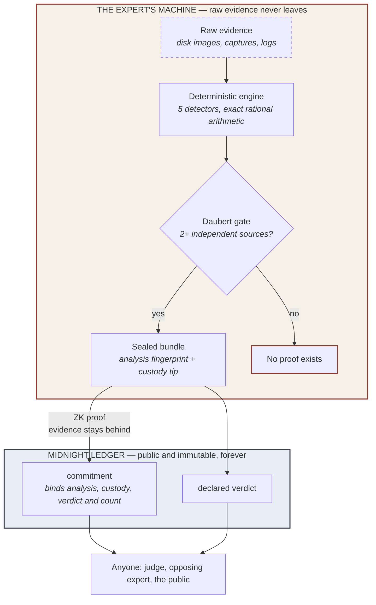

# VELO

> **The verdict is visible. The victim is not.**
> *El veredicto se ve, la víctima no.*

Zero-knowledge attestation of forensic verdicts on [Midnight](https://midnight.network).
A forensic expert can prove their verdict is legitimate **without ever
publishing the evidence it came from**.

> VELO proves that a specific verdict was produced by a specific process,
> under specified constraints, and that the resulting attestation cannot be
> altered afterward. It does not replace forensic judgment; it makes forensic
> judgment auditable. (See "What the proof does and does not establish" in
> [`docs/ARCHITECTURE.md`](./docs/ARCHITECTURE.md) for exactly where that
> boundary sits.)

`Apache-2.0` · `TypeScript + Compact` · Built at Midnight Hack Buenos Aires, 7–8 August 2026

---

## The problem

A forensic expert analysing a case — abuse material, a fraud, a leak — has two
options today, and both are bad:

1. **Publish the raw evidence** so others can check the verdict. The victim is
   exposed to everyone in the process who did not need to see it.
2. **Publish nothing**, and ask the court to take the expert's word for it.

Every digital forensics workflow in production picks one. VELO picks neither.

## How

The expert runs a deterministic engine on their own machine, seals the result,
and publishes **only a commitment and a zero-knowledge proof**. The proof
establishes two things at once: that the published verdict really corresponds
to the sealed analysis, and that a formalized admissibility criterion inspired
by the Daubert standard was satisfied —
*at least two sources, declared independent by the analyst and distinct by
provenance-chain root, for a `MALICE` verdict*.

That rule is not a policy note or a code review convention. It is a constraint
inside the circuit: **an attestation that violates it cannot be produced at
all.** (What the circuit cannot see is *where* the source count came from —
see "What the proof does and does not establish" below and
`docs/RED_TEAM_ROUND_2.md`.)



The raw evidence never crosses the boundary. What crosses is a commitment, the
declared verdict, a timestamp, and a proof about them — that is enough for
anyone watching the chain to learn that an investigation existed, roughly when,
and its outcome category, even without seeing the case itself.

## The part that makes it real: the system refuses

Anyone can build something that says yes. The interesting behaviour is what
happens when the rules are not met — and both refusals are demonstrated live in
[`src/simulate.ts`](./src/simulate.ts) (`npm run simulate`):

**Refusal 1 — not enough independent sources.** Evidence that would score high
enough for `MALICE`, but all traced back to a single acquisition:

```
[ATTEMPTED VERDICT] SUSPICION
[WHY] Score 0.3000 above the noise ceiling but below the MALICE threshold.

Correctly refused. The Daubert corroboration gate held — this is not a
promise, it's a constraint.
```

**Refusal 2 — no chain of custody.** Byte-for-byte the *same* artifacts that
produced `MALICE`, with only the acquisition record removed:

```
[VERDICT WITH CUSTODY]     MALICE
[VERDICT WITHOUT CUSTODY]  ABSTAIN

Identical evidence, opposite outcome. Admissibility is a property of the
process, not of how incriminating the evidence looks.
```

A finding nobody can trace back to a lawful acquisition is not a weaker
finding. It is an inadmissible one.

## Try it

```bash
npm install
npm test          # 34 tests, including adversarial ones
npm run simulate  # full end-to-end story, both refusals
```

Verify a sealed bundle with the standalone verifier — one file, no
dependencies, nothing from this repo required:

```bash
node dist/src/seal/verify.js path/to/bundle.json
```

It prints `internally consistent: YES/NO` — deliberately *not* the word
"valid", because a reader takes "valid" to mean "authentic", and internal
consistency is a strictly weaker claim. See [F4 in the red team
report](./docs/RED_TEAM_ROUND_1.md).

### The local UI and its API

```bash
npm run web     # http://127.0.0.1:4310
```

Binds to `127.0.0.1` and nothing else, by design rather than by default:
a machine holding a victim's evidence must not open a port to its network.
Static files come from `src/web/static/` (override with `VELO_STATIC_DIR`).

| Method | Endpoint | Purpose |
|---|---|---|
| `POST` | `/api/seal` | Run the engine and seal a case |
| `GET` | `/api/cases` | List sealed cases — `{ cases, unreadable }` |
| `GET` | `/api/cases/:caseId` | Public summary of one case |
| `GET` | `/api/cases/:caseId/verify` | Internal-consistency check |
| `GET` | `/api/attest` | `501` — the contract is deployed, but this endpoint does not call it yet |

`POST /api/seal` takes `{ caseId, artifacts[], devilAdvocate, custodyEvents[] }`
and returns the sealed summary plus `reasoning`, `custodyValid`,
`corroboratingSources[]` and `detectorsFired[]` — enough for a UI to show *why*
a verdict landed where it did, without ever receiving the evidence.

Sending `custodyEvents: []` is not an error: it produces `ABSTAIN`, because
evidence with no acquisition history is inadmissible whatever it shows.

Both interfaces call the same functions in `src/core/operations.ts`. Neither
reimplements the other — red team F8 was two copies of one function that had
already drifted apart before anyone noticed.

### As an MCP server

The same engine is exposed over MCP, so an agent can drive the flow
conversationally — a wallet, but the asset is a sealed case instead of money.

```bash
npm run build
claude mcp add velo -- node "$(pwd)/dist/src/mcp/server.js"
```

| Wallet concept | VELO tool |
|---|---|
| Balance view | `list_my_cases` |
| Asset detail | `get_case` |
| Mint | `seal_case` |
| Block explorer | `verify_commitment` |
| Send transaction | `attest_case` *(not wired yet)* |
| Block explorer, on-chain | `chain_status`, `lookup_commitment` — live reads of the deployed contract |

### Deploying

`deploy/deploy-contract.ts` deploys `contracts/velo.compact` to the network in
`deploy/network-config.ts` (`preview` by default — the hackathon's official
network). It runs under [Bun](https://bun.sh), not `npm run build && node`:
the deploy dependency ships raw `.ts` exports that plain `tsc`/`node` cannot
resolve.

Three environment variables, and they are three different kinds of thing —
worth stating plainly, because conflating them costs time:

| Variable | What it is | Where it comes from |
|---|---|---|
| `MIDNIGHT_WALLET_MNEMONIC` | The wallet's recovery phrase (24 words, quoted) | The wallet you funded. Verified working with a **1AM** phrase — standard BIP39 derivation |
| `MIDNIGHT_WALLET_SEED` | The hex seed *derived from* that phrase | Only if you already have a raw seed — otherwise don't set it |
| `MIDNIGHT_STORAGE_PASSWORD` | A local disk-encryption password. Nothing to do with any wallet | You invent it |

Set **either** the mnemonic **or** the seed. If both are set the seed wins and
the mnemonic is silently ignored — `unset MIDNIGHT_WALLET_SEED` if a stale one
is exported.

**Step 1 — register NIGHT for DUST generation. Once per wallet:**

```bash
MIDNIGHT_NETWORK_ID=preview \
MIDNIGHT_STORAGE_PASSWORD=<a-real-secret-you-pick> \
MIDNIGHT_WALLET_MNEMONIC="word1 word2 ... word24" \
bun run deploy/register-dust.ts
```

**Step 2 — deploy, with the same variables, and do it promptly:**

```bash
MIDNIGHT_NETWORK_ID=preview \
MIDNIGHT_STORAGE_PASSWORD=<a-real-secret-you-pick> \
MIDNIGHT_WALLET_MNEMONIC="word1 word2 ... word24" \
bun run deploy/deploy-contract.ts
```

#### The two errors you will probably hit

**`Insufficient Funds: could not balance dust`** — not a funding problem, and
more tokens will not fix it. Fees are paid in DUST, which is *generated* by
NIGHT that has been explicitly **registered** for dust generation — a separate
on-chain transaction that `deployMidnightContract` never performs (its wallet
setup waits only on the *shielded* balance and discards the dust balance it
computes). That is what step 1 is for. Registration state lives on-chain, so it
is once per wallet, not per deploy.

**`1010: Invalid Transaction: Custom error: 170`** — this is
`InvalidDustSpendProof`: the node rejected the **DUST fee proof**, not your
contract. Two known causes. First, a misaligned fee stack — check every
component against the [compatibility
matrix](https://docs.midnight.network/relnotes/support-matrix) (Preview wants
proof server `8.1.0`; note `midnightntwrk/proof-server:latest` and `:8.1.0`
are currently the same digest, and a `created=1970-01-01` timestamp on that
image is a reproducible-build artifact, *not* a stale image). Second — the one
that actually bit us — **stale DUST state**: if the dust sync is still settling
when the transaction is built, the spend proof references a merkle root that is
being superseded. The symptom in the logs is `dust=` flipping `true → false →
true` near the end of the sync. The fix is freshness, not versions: re-run, and
submit while the state is fresh. Our failing run showed exactly that flip; the
successful run had `dust=true` stable, with nothing else changed.

**Use a wallet with nothing in it you can't afford to lose.** The deploy
dependency logs the wallet seed to stdout as part of its normal, unconditional
output — this repo redacts that line before it reaches your terminal (red
team [F16](./docs/RED_TEAM_ROUND_4.md)), but that is a mitigation around a
third-party default, not a guarantee the way the rest of this project's
guarantees are. Treat any wallet used here as disposable regardless.

`MIDNIGHT_STORAGE_PASSWORD` has no default — pick a real secret and never
commit it. It encrypts the local signing-key store, not a throwaway
namespace string (red team [F17](./docs/RED_TEAM_ROUND_4.md), fixed: this
used to fall back to a hardcoded value).

## Status — what is real and what is not

This project is 48 hours old. The table is honest on purpose; overclaiming is
the failure mode this whole system exists to prevent.

| Layer | State |
|---|---|
| Deterministic engine + Daubert gate | **Working**, 34 tests |
| Local sealing, custody chain, canonical hashing | **Working** |
| Standalone offline verifier | **Working** |
| MCP server (local tools) | **Working**, tested over real JSON-RPC |
| Red team round 1 | **12 of 13 findings fixed**, [full report](./docs/RED_TEAM_ROUND_1.md) |
| Compact contract | **Compiles** — `compact 0.31.1`, both circuits, prover and verifier keys generated. Reproduce with `bash scripts/compile-contract.sh` |
| Contract deployed to Midnight | **Live on `preview`** — address [`46cac58c4eb0e034b4211d754bfe67f7e8e1aa08d448ebd089437ed573023d9d`](https://explorer.preview.midnight.network) (deployed 2026-08-07 via `bun run deploy/deploy-contract.ts`) |
| Reading the ledger from the app | **Working** — `GET /api/chain` and the MCP tools `chain_status` / `lookup_commitment` read the deployed contract's real state. No wallet, no proving keys, no fees |
| Writing (`attest`) from the app | **Not wired** — `attest_case` / `POST /api/attest` still compute a local commitment and do not call the deployed contract |
| Selective disclosure, ZK expert credential, blind second opinion | **Not built** |

The honest bottom line: the expert's side of the boundary runs and is tested,
the circuit compiles into real proving keys, and the contract is deployed and
live on `preview`. What does **not** yet exist is the last hop — `attest_case`
and `POST /api/attest` still compute a commitment locally and return
`local_pending_contract`; neither calls the deployed contract's `attest`
circuit. A deployed contract nobody calls is a deployed contract, not a working
attestation, and this table says so rather than letting "deployed" imply
"working end to end".

## Repository

```
src/engine/      detectors, scoring, exact rational arithmetic (no floats on the decision path)
src/seal/        canonicalization, hash-chained custody, bundle sealing, standalone verifier
src/witness/     the circuit's private inputs, TypeScript side
src/mcp/         MCP server — the wallet interface
contracts/       velo.compact — the ZK gate
cases/           13 synthetic cases, zero PII
peritos-syntetic/ 6 synthetic expert-witness profiles
docs/            architecture, glossary, cases, FAQ, business case, identity, roadmap, red team reports
visual/          deck backgrounds + standalone SVG diagrams
```

Documentation is bilingual (EN/ES): [`ARCHITECTURE`](./docs/ARCHITECTURE.md) ·
[`GLOSSARY`](./docs/GLOSSARY.md) · [`CASES`](./docs/CASES.md) ·
[`FAQ`](./docs/FAQ.md) · [`BUSINESS`](./docs/BUSINESS.md) ·
[`IDENTITY`](./docs/IDENTITY.md) · [`ROADMAP`](./docs/ROADMAP.md) ·
[`RED TEAM 1`](./docs/RED_TEAM_ROUND_1.md) ·
[`RED TEAM 2`](./docs/RED_TEAM_ROUND_2.md) ·
[`RED TEAM 3`](./docs/RED_TEAM_ROUND_3.md) ·
[`RED TEAM 4`](./docs/RED_TEAM_ROUND_4.md) ·
[`FRONTEND TDD`](./docs/FRONTEND_TDD.md)

Standalone illustrated pages, same visual system, EN/ES toggle in the page
itself: [`Architecture`](./docs/velo-architecture.html) ·
[`Identity`](./docs/velo-identity.html) ·
[`Business case`](./docs/velo-business.html) ·
[`Roadmap`](./docs/velo-roadmap.html). Static diagrams for the pitch deck
are in [`visual/`](./visual/) (`diagram-flow.svg`, `diagram-dual-ledger.svg`,
`diagram-verdict-scale.svg`).

[`INSPIRATIONS.md`](./INSPIRATIONS.md) records the prior work these concepts
were adapted from, and why none of it is copy-pasted: those projects are
Python, this one is TypeScript and Compact.

## Development conventions

This repository follows a small, explicit set of engineering conventions so that
reviews stay focused on substance rather than formatting. The rules are enforced
automatically where possible.

- **Conventional Commits v1.0.0** — every commit message follows the
  `<type>[optional scope]: <description>` shape. A Husky `commit-msg` hook runs
  [`commitlint`](https://commitlint.js.org/) with
  `@commitlint/config-conventional`, and a non-conforming message is rejected
  before it is recorded.
- **Semantic Versioning 2.0.0** — the package version (`package.json`) is the
  single source of truth and is bumped with `npm version` (e.g. `npm version
  minor`).
- **Keep a Changelog 1.1.0** — notable changes are recorded in
  [`CHANGELOG.md`](./CHANGELOG.md), grouped under Added / Changed / Deprecated /
  Removed / Fixed / Security, with an `Unreleased` section at the top.
- **Husky pre-commit / pre-push setup** — a Husky `prepare` script installs the
  git hooks on `npm install`. The `commit-msg` hook enforces Conventional
  Commits; add a `pre-commit` or `pre-push` hook under `.husky/` for further
  local guards.

Full rules and examples are in [`CONTRIBUTING.md`](./CONTRIBUTING.md).

---

## Español

Hoy un perito forense tiene dos opciones, y las dos son malas: **publicar la
evidencia cruda** para que otros puedan verificar el veredicto —exponiendo a la
víctima ante todos los que no necesitaban verla— o **no publicar nada** y pedirle
al tribunal que confíe en su palabra.

VELO no elige ninguna. El perito corre un motor determinista en su propia
máquina, sella el resultado, y publica **solo un commitment y una prueba de
conocimiento cero**. La prueba establece dos cosas a la vez: que el veredicto
publicado corresponde al análisis sellado, y que se cumplió un criterio de
admisibilidad formalizado, inspirado en el estándar Daubert — *al menos dos
fuentes, declaradas independientes por el analista y distintas por raíz de
cadena de proveniencia, para un veredicto `MALICE`*.

> VELO prueba que un veredicto específico fue producido por un proceso
> específico, bajo restricciones especificadas, y que la atestación resultante
> no puede alterarse después. No reemplaza el juicio forense; lo hace
> auditable. (Ver "Qué prueba la prueba y qué no" en
> [`docs/ARCHITECTURE.md`](./docs/ARCHITECTURE.md) para saber exactamente
> dónde está ese límite.)

Esa regla no es una nota de política ni una convención de code review. Es una
restricción dentro del circuito: **una atestación que la viole no puede
producirse.**

Lo interesante no es que el sistema diga que sí, sino cómo se niega. `npm run
simulate` demuestra las dos negativas en vivo: evidencia que alcanzaría para
`MALICE` pero proviene de una sola adquisición degrada a `SUSPICION`; y la
*misma* evidencia byte a byte, sin cadena de custodia, da `ABSTAIN`. Evidencia
idéntica, resultado opuesto: la admisibilidad es una propiedad del proceso, no
de qué tan incriminatoria se ve la evidencia.

**Estado honesto:** todo lo del lado del perito funciona y está testeado (34
tests), y el contrato Compact **compila** — los dos circuitos, con claves de
prueba y verificación generadas (`bash scripts/compile-contract.sh`). Lo que
todavía no existe es la integración cliente: nada se desplegó a una red y
`attest_case` sigue siendo un stub que devuelve un error explícito en vez de
simular. La divulgación selectiva y la credencial ZK del perito tampoco están
construidas.

---

## Authors

- [annatchijova](https://github.com/annatchijova)
- [olgavasilievaveg-hash](https://github.com/olgavasilievaveg-hash/)
- [Dahgoth](https://github.com/Dahgoth)

Project page: [annatchijova.github.io/vigia/velo.html](https://annatchijova.github.io/vigia/velo.html)

## License

Apache License 2.0 — see [`LICENSE`](./LICENSE).
