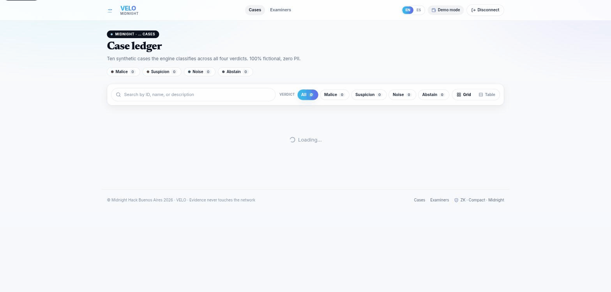
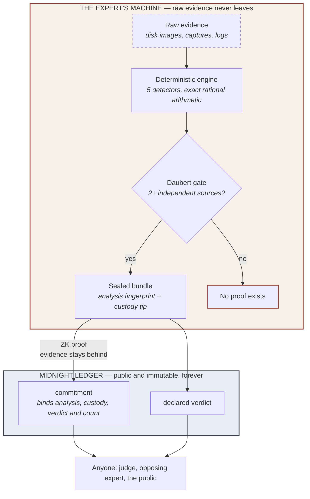
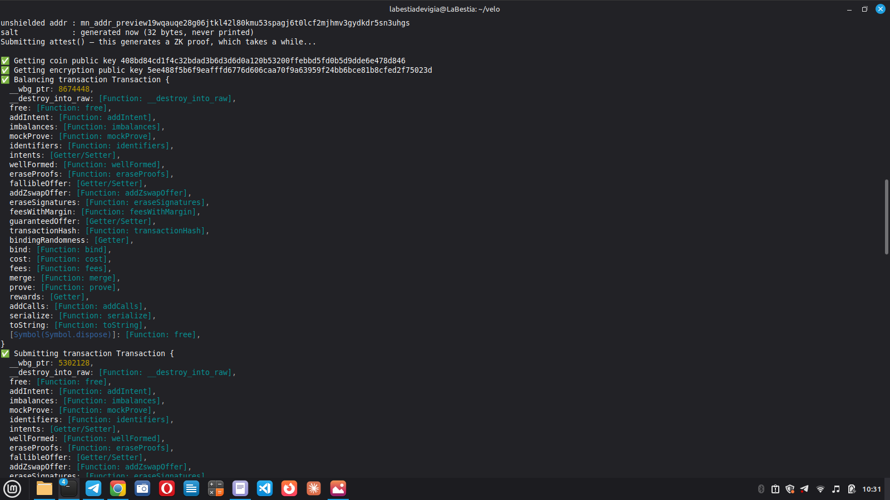
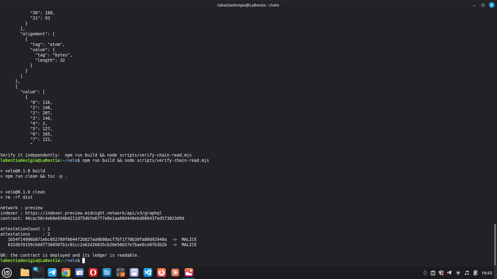
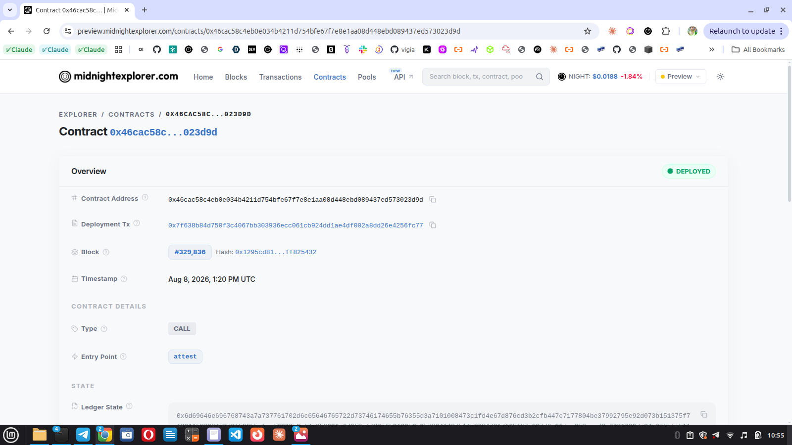
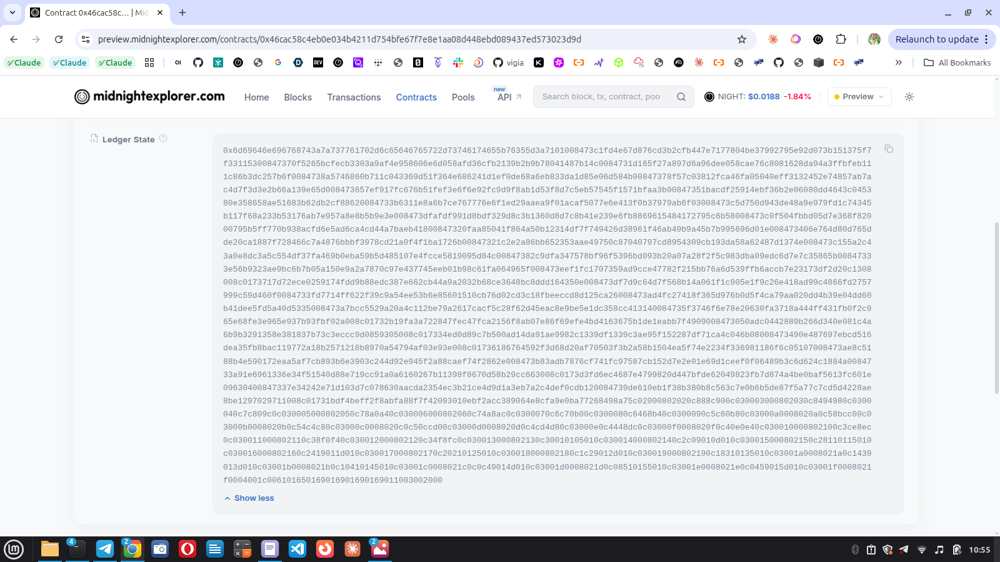

<div align="center">


</div>

# VELO

> **The verdict is visible. The victim is not.**
> *El veredicto se ve, la víctima no.*

<div align="center">

## ▶ [Open the VELO Hub — the whole project on one page](https://velo-hub-zeta.vercel.app/)

[](https://velo-hub-zeta.vercel.app/)

</div>

Zero-knowledge attestation of forensic verdicts on [Midnight](https://midnight.network).
A forensic expert can prove their verdict is legitimate **without ever
publishing the evidence it came from**.

> VELO proves that a specific verdict was produced by a specific process,
> under specified constraints, and that the resulting attestation cannot be
> altered afterward. It does not replace forensic judgment; it makes forensic
> judgment auditable. (See "What the proof does and does not establish" in
> [`docs/ARCHITECTURE.md`](./docs/ARCHITECTURE.md) for exactly where that
> boundary sits.)

`Apache-2.0` · `TypeScript + Compact` · Built on Midnight

📄 **[Léelo en español (README.es.md)](./README.es.md)**

⚡ **[Quick start (EN/ES)](./docs/QUICKSTART.md)** — copy-paste setup, the 14 cases one at a time, the demos, and every adversarial script with what it proves.

🔗 **[Verify it on the Midnight explorer](https://preview.midnightexplorer.com/contracts/0x46cac58c4eb0e034b4211d754bfe67f7e8e1aa08d448ebd089437ed573023d9d)** — the deployed contract and its attestations, on a block explorer we do not control. Nothing to install.

**Live demo: [velo-1028999311218.us-central1.run.app](https://velo-1028999311218.us-central1.run.app)** — reading the real deployed contract on Midnight preview. No wallet, keys, or install required to browse it.

**Demo video: [youtu.be/AHBEUcrzf48](https://youtu.be/AHBEUcrzf48)** — a walkthrough of the flow, end to end.



## Explore

Every page below is bilingual (EN/ES).

- **[Live app](https://velo-1028999311218.us-central1.run.app)** — the running frontend on Google Cloud Run, reading the real on-chain ledger.
- **[Pitch deck](https://annatchijova.github.io/vigia/velo-pitch-deck.html)** — the bilingual slide deck.
- **[Architecture diagram](https://annatchijova.github.io/vigia/veloarchitecture-diagram.html)** — the one-picture "one side proves, the other stays sealed" view.
- **[Architecture](https://annatchijova.github.io/vigia/velo-architecture.html)** — the full write-up, from [`docs/ARCHITECTURE.md`](./docs/ARCHITECTURE.md).
- **[Technical status](https://annatchijova.github.io/vigia/velotechnical-status.html)** — what is real vs. pending, layer by layer.
- **[Identity model](https://annatchijova.github.io/vigia/velo-identity.html)** — accredited-expert authorization, not biometric identification.
- **[Business case](https://annatchijova.github.io/vigia/velo-business.html)** — the forensic-reputation layer and its use cases.
- **[Why ZK is load-bearing](https://annatchijova.github.io/vigia/velo-sin-zk-no-hay-velo.html)** — why zero-knowledge is architecturally essential to VELO, not an optional feature.
- **[Roadmap](https://annatchijova.github.io/vigia/velo-roadmap.html)** — delivered layers and what comes next.

## Run it locally

Step by step, on a fresh machine: **[docs/QUICKSTART.md](./docs/QUICKSTART.md)**.

No secrets are needed to browse the demo — the wallet and keys only matter for *attesting* (the write path), never for running the UI or reading the chain.

```bash
git clone https://github.com/annatchijova/velo.git
cd velo

npm install        # npm workspaces: installs the root engine + the frontend
npm run build      # compiles dist/, which the frontend imports as `velo/*`

cd frontend
npm run dev        # http://localhost:3000
```

Node 20+ is required. The first page load compiles on demand, so it takes a few
seconds — that is Next.js building, not a hang.

---

## The problem

A forensic expert analysing a case — abuse material, a fraud, a leak — has two
options today, and both are bad:

1. **Publish the raw evidence** so others can check the verdict. The victim is
   exposed to everyone in the process who did not need to see it.
2. **Publish nothing**, and ask the court to take the expert's word for it.

Every digital forensics workflow in production picks one. VELO picks neither.

## In plain terms, step by step

1. **The expert has the case on their own computer** — disk images, logs,
   captures. It never leaves that machine.
2. **They ask VELO to analyze it over MCP** (the same protocol AI agents use
   to call tools) — the expert connects their client and calls `seal_case`.
   There is no upload form.
3. **A mathematical engine analyzes the evidence — not an AI.** It checks for
   5 kinds of tampering signals using fixed rules, no rounding, no
   randomness: the same input always produces the same verdict, on any
   machine.
4. **The engine forces the expert to argue against themselves.** If the
   result qualifies for the most serious verdict (`MALICE`), the system
   automatically downgrades it unless the expert has written a
   counter-argument against their own finding.
5. **Everything is sealed locally** with a hash chain — a seal that visibly
   breaks if anyone touches it afterward.
6. **A zero-knowledge proof is generated** that the admissibility rules were
   followed, without revealing a single line of the case.
7. **Only that proof, a hash (the "commitment"), and the verdict get
   published to Midnight.** The raw evidence never crosses that line.
8. **Anyone — a judge, opposing counsel, the public — can verify** that the
   verdict is real and that the rules were followed, without seeing a single
   file from the case.

The technical version of the same flow — diagram and the exact rules the
circuit enforces — follows below.

## How


The expert runs a deterministic engine on their own machine, seals the result,
and publishes **only a commitment and a zero-knowledge proof**. The proof
establishes two things at once: that the published verdict really corresponds
to the sealed analysis, and that a formalized admissibility criterion inspired
by the Daubert standard was satisfied —
*at least two sources, declared independent by the analyst and distinct by
provenance-chain root, for a `MALICE` verdict*.

That rule is not a policy note or a code review convention. It is a constraint
inside the circuit: **an attestation that violates it cannot be produced at
all.** (What the circuit cannot see is *where* the source count came from —
see "What the proof does and does not establish" below and
`docs/RED_TEAM_ROUND_2.md`.)

We confirmed this adversarially against the deployed contract. Forcing a
`MALICE` verdict with a single corroborating source — submitted straight at the
circuit, past the engine and every application-level check — is refused by the
circuit's own assert:

```
failed assert: MALICE requires at least 2 independent corroborating sources — the Daubert gate
```

No proof is produced, so nothing reaches the ledger. The guarantee is
cryptographic, not a promise in our code (`deploy/attest-forced-malice.ts`;
see `docs/TECHNICAL_STATUS.md` §2.2).



The raw evidence never crosses the boundary. What crosses is a commitment, the
declared verdict, a timestamp, and a proof about them — that is enough for
anyone watching the chain to learn that an investigation existed, roughly when,
and its outcome category, even without seeing the case itself.

**Without zero-knowledge, there is no VELO.** Take the proof out and the two bad
options come straight back: publish the evidence and expose the victim, or
publish nothing and ask the court to trust you. The ZK proof is the only thing
that lets the verdict be public while the evidence stays sealed — it is not a
feature bolted onto the product, it *is* the product.
([Why ZK is load-bearing](https://annatchijova.github.io/vigia/velo-sin-zk-no-hay-velo.html).)

## The part that makes it real: the system refuses

Anyone can build something that says yes. The interesting behaviour is what
happens when the rules are not met — and both refusals are demonstrated live in
[`src/simulate.ts`](./src/simulate.ts) (`npm run simulate`):

**Refusal 1 — not enough independent sources.** Evidence that would score high
enough for `MALICE`, but all traced back to a single acquisition:

```
[ATTEMPTED VERDICT] SUSPICION
[WHY] Score 0.3000 above the noise ceiling but below the MALICE threshold.

Correctly refused. The Daubert corroboration gate held — this is not a
promise, it's a constraint.
```

**Refusal 2 — no chain of custody.** Byte-for-byte the *same* artifacts that
produced `MALICE`, with only the acquisition record removed:

```
[VERDICT WITH CUSTODY]     MALICE
[VERDICT WITHOUT CUSTODY]  ABSTAIN

Identical evidence, opposite outcome. Admissibility is a property of the
process, not of how incriminating the evidence looks.
```

A finding nobody can trace back to a lawful acquisition is not a weaker
finding. It is an inadmissible one.

## Try it

```bash
npm install
npm test          # 161 engine tests, including adversarial ones
cd frontend && npx vitest run   # 116 more — 277 across both suites
npm run simulate  # full end-to-end story, both refusals
```

Verify a sealed bundle with the standalone verifier — one file, no
dependencies, nothing from this repo required:

```bash
node dist/src/seal/verify.js path/to/bundle.json
```

It prints `internally consistent: YES/NO` — deliberately *not* the word
"valid", because a reader takes "valid" to mean "authentic", and internal
consistency is a strictly weaker claim. See [F4 in the red team
report](./docs/RED_TEAM_ROUND_1.md).

### The browser frontend

The UI is the Next.js app in [`frontend/`](./frontend/) — pages plus API
routes that run the same engine server-side through the `velo` package. Local
development:

```bash
cd frontend && npm run dev     # http://127.0.0.1:3000
```

The `dev` script passes `--hostname 127.0.0.1` explicitly. Next.js binds to
`0.0.0.0` by default — verified in its own CLI definition, which documents
`-H, --hostname` as `(default: 0.0.0.0)` — so without that flag the dev
server is reachable from every machine on the network. A machine holding
someone else's evidence must not open a port to its network, and that has
to be stated in the script rather than assumed from a default that says the
opposite.

`npm start` is deliberately left on the default. It is the container entry
point (see `frontend/Dockerfile`), and inside a container binding to
`0.0.0.0` is correct — the isolation boundary is the container, not the
interface. Do not "fix" it to match `dev`.

| Method | Endpoint | Purpose |
|---|---|---|
| `POST` | `/api/seal` | Run the engine and seal a case |
| `GET` | `/api/cases` | List sealed cases — `{ cases, unreadable }` |
| `GET` | `/api/cases/:id` | Public summary of one case |
| `POST` | `/api/verify` | Internal-consistency check. Takes `{ bundle, tamper? }`; `tamper` re-runs the check against a deliberately corrupted copy, so the UI can demonstrate detection rather than claim it |
| `GET` | `/api/chain` | What the Midnight ledger says right now. Reading needs no wallet, proving keys, or proof server, so it keeps working on a machine that cannot produce a proof |
| `GET` | `/api/peritos` | The synthetic expert-witness corpus |
| `GET` | `/api/attest` | `501` — the contract is deployed, but this endpoint does not call it yet |

`POST /api/seal` takes `{ caseId, artifacts[], devilAdvocate, custodyEvents[] }`
and returns the sealed summary plus `reasoning`, `custodyValid`,
`corroboratingSources[]` and `detectorsFired[]` — enough for a UI to show *why*
a verdict landed where it did, without ever receiving the evidence.

Sending `custodyEvents: []` is not an error: it produces `ABSTAIN`, because
evidence with no acquisition history is inadmissible whatever it shows.

The browser API routes and the MCP server call the same functions in
`src/core/operations.ts`. Neither reimplements the other — red team F8 was two
copies of one function that had already drifted apart before anyone noticed.

### Deploying (Google Cloud Run)

The app is **live at
[velo-1028999311218.us-central1.run.app](https://velo-1028999311218.us-central1.run.app)**,
deployed as a container from the repo-root `Dockerfile` (multi-stage: install
→ build the root engine → `next build` → `next start` on Cloud Run's `$PORT`):

```bash
gcloud run deploy velo --source . --region us-central1
```

Project `vigia-497422`, `us-central1`, `--allow-unauthenticated`,
`min-instances 0` (scales to zero; a few seconds of cold start on the first
request). The build context is the **repo root**: the image must carry the
root package's `dist/`, the corpus, `contracts/managed/` (the committed
bindings `/api/chain` loads at request time) and
`deploy/managed-shim/` (the deployed contract address).

The corpus routes (`/api/cases`, `/api/cases/:id`, `/api/peritos`) are
**static at build time** (`force-static` + `generateStaticParams`), so the
runtime never reads the repo filesystem for them. Chain reads
(`GET /api/chain`) run in the container via the committed contract bindings —
no wallet, keys, or fees. Attestation **writes never run in the hosted app**;
they stay on the expert's machine (`deploy/attest-case.ts`, see
[CHAIN](./docs/CHAIN.md)).

Why not Vercel: the `@vercel/next` builder failed reproducibly on its side
(`ENOENT` on `export-detail.json` after a successful `next build`); the pivot
is recorded in [`ADR-007`](./docs/ADRS_001_006.md). `frontend/vercel.json`
and the related config remain in the repo, unused.

### As an MCP server

The same engine is exposed over MCP, so an agent can drive the flow
conversationally — a wallet, but the asset is a sealed case instead of money.

```bash
npm run build
claude mcp add velo -- node "$(pwd)/dist/src/mcp/server.js"
```

| Wallet concept | VELO tool |
|---|---|
| Balance view | `list_my_cases` |
| Asset detail | `get_case` |
| Mint | `seal_case` |
| Block explorer | `verify_commitment` |
| Send transaction | `attest_case` *(not wired yet)* |
| Block explorer, on-chain | `chain_status`, `lookup_commitment` — live reads of the deployed contract |

### Deploying

`deploy/deploy-contract.ts` deploys `contracts/velo.compact` to the network in
`deploy/network-config.ts` (`preview` by default). It runs under [Bun](https://bun.sh), not `npm run build && node`:
the deploy dependency ships raw `.ts` exports that plain `tsc`/`node` cannot
resolve.

Three environment variables, and they are three different kinds of thing —
worth stating plainly, because conflating them costs time:

| Variable | What it is | Where it comes from |
|---|---|---|
| `MIDNIGHT_WALLET_MNEMONIC` | The wallet's recovery phrase (24 words, quoted) | The wallet you funded. Verified working with a **1AM** phrase — standard BIP39 derivation |
| `MIDNIGHT_WALLET_SEED` | The hex seed *derived from* that phrase | Only if you already have a raw seed — otherwise don't set it |
| `MIDNIGHT_STORAGE_PASSWORD` | A local disk-encryption password. Nothing to do with any wallet | You invent it |

Set **either** the mnemonic **or** the seed. If both are set the seed wins and
the mnemonic is silently ignored — `unset MIDNIGHT_WALLET_SEED` if a stale one
is exported.

**Step 1 — register NIGHT for DUST generation. Once per wallet:**

```bash
MIDNIGHT_NETWORK_ID=preview \
MIDNIGHT_STORAGE_PASSWORD=<a-real-secret-you-pick> \
MIDNIGHT_WALLET_MNEMONIC="word1 word2 ... word24" \
bun run deploy/register-dust.ts
```

**Step 2 — deploy, with the same variables, and do it promptly:**

```bash
MIDNIGHT_NETWORK_ID=preview \
MIDNIGHT_STORAGE_PASSWORD=<a-real-secret-you-pick> \
MIDNIGHT_WALLET_MNEMONIC="word1 word2 ... word24" \
bun run deploy/deploy-contract.ts
```

#### The two errors you will probably hit

**`Insufficient Funds: could not balance dust`** — not a funding problem, and
more tokens will not fix it. Fees are paid in DUST, which is *generated* by
NIGHT that has been explicitly **registered** for dust generation — a separate
on-chain transaction that `deployMidnightContract` never performs (its wallet
setup waits only on the *shielded* balance and discards the dust balance it
computes). That is what step 1 is for. Registration state lives on-chain, so it
is once per wallet, not per deploy.

**`1010: Invalid Transaction: Custom error: 170`** — this is
`InvalidDustSpendProof`: the node rejected the **DUST fee proof**, not your
contract. Two known causes. First, a misaligned fee stack — check every
component against the [compatibility
matrix](https://docs.midnight.network/relnotes/support-matrix) (Preview wants
proof server `8.1.0`; note `midnightntwrk/proof-server:latest` and `:8.1.0`
are currently the same digest, and a `created=1970-01-01` timestamp on that
image is a reproducible-build artifact, *not* a stale image). Second — the one
that actually bit us — **stale DUST state**: if the dust sync is still settling
when the transaction is built, the spend proof references a merkle root that is
being superseded. The symptom in the logs is `dust=` flipping `true → false →
true` near the end of the sync. The fix is freshness, not versions: re-run, and
submit while the state is fresh. Our failing run showed exactly that flip; the
successful run had `dust=true` stable, with nothing else changed.

**Use a wallet with nothing in it you can't afford to lose.** The deploy
dependency logs the wallet seed to stdout as part of its normal, unconditional
output — this repo redacts that line before it reaches your terminal (red
team [F16](./docs/RED_TEAM_ROUND_4.md)), but that is a mitigation around a
third-party default, not a guarantee the way the rest of this project's
guarantees are. Treat any wallet used here as disposable regardless.

`MIDNIGHT_STORAGE_PASSWORD` has no default — pick a real secret and never
commit it. It encrypts the local signing-key store, not a throwaway
namespace string (red team [F17](./docs/RED_TEAM_ROUND_4.md), fixed: this
used to fall back to a hardcoded value).

## Status — what is real and what is not

This project is 48 hours old. The table is honest on purpose; overclaiming is
the failure mode this whole system exists to prevent.

| Layer | State |
|---|---|
| Deterministic engine + Daubert gate | **Working**, 161 tests |
| Test coverage across both suites | **277 green** — 161 engine (`npm test`) + 116 frontend (`vitest run` in `frontend/`). Counted by the runners, not estimated — `node scripts/count-tests.mjs` re-measures and fails if this line drifts |
| Local sealing, custody chain, canonical hashing | **Working** |
| Standalone offline verifier | **Working** |
| MCP server (local tools) | **Working**, tested over real JSON-RPC |
| Red team | **6 rounds** — full reports RT1–RT6 linked below |
| Compact contract | **Compiles** — `compact 0.31.1`, both circuits, prover and verifier keys generated. Reproduce with `bash scripts/compile-contract.sh` |
| Contract deployed to Midnight | **Live on `preview`** — address [`46cac58c4eb0e034b4211d754bfe67f7e8e1aa08d448ebd089437ed573023d9d`](https://preview.midnightexplorer.com/contracts/0x46cac58c4eb0e034b4211d754bfe67f7e8e1aa08d448ebd089437ed573023d9d) (deployed 2026-08-07 via `bun run deploy/deploy-contract.ts`) |
| Reading the ledger from the app | **Working** — `GET /api/chain` and the MCP tools `chain_status` / `lookup_commitment` read the deployed contract's real state. No wallet, no proving keys, no fees |
| Writing (`attest`) on-chain | **Working** — `bun run deploy/attest-case.ts <caseId>` proves and submits a real `attest()` call. **Two attestations are live on preview**, both `MALICE`. The circuit's replay guard (red team G2) verified against the real network: re-attesting the same analysis is refused, not double-counted |
| Writing from the browser UI | **Not wired** — `POST /api/attest` still computes a local commitment; the 1AM-signed path does not exist yet |
| Selective disclosure, ZK expert credential, blind second opinion | **Not built** |

The honest bottom line: the loop closes. A case is sealed locally, attested
on-chain with a real ZK proof, and read back from the ledger by anyone — all
three steps run against Midnight `preview`, not a simulation.

What does **not** yet exist is the browser-signed path: `POST /api/attest`
still computes a commitment locally rather than having the analyst's own 1AM
wallet sign the transaction. Attesting today goes through
`deploy/attest-case.ts`, which signs with a seed-derived wallet on the
analyst's own machine. Architecturally that is the CLI equivalent of the same
thing, but it is not the same as the wallet-connected UI the demo shows, and
this table would rather say so than let one imply the other.

### The write path, end to end

Not a diagram of the intended flow — the actual terminal, on `preview`.



`attest()` proving and submitting. The salt line is the point: it is generated
locally and never printed, because knowing it is what would let someone confirm
a guess at the values behind the commitment.



Then the same claim checked from the other side, by a script that shares no
state with the one that wrote it:

```
attestationCount : 2
attestations     : 2
   1b54f14996b871ebc052789f604472b827aa9b98acf7bf1f70b39fa80d92940a  ->  MALICE
   632dbf0159cb6df7360507b1c01cc2a62d26035cb20e56b57e7bae0ce8fb3b2b  ->  MALICE
```

Reproduce it yourself — no wallet, no keys, no proof server, no fees:

```bash
npm run build && node scripts/verify-chain-read.mjs
```

What those two lines establish: two commitments exist on `preview`, each bound
to a `MALICE` verdict, each carrying a proof that the Daubert gate held when it
was written. What they do **not** establish is who produced the analyses behind
them, or that those analyses are correct — the chain shows that someone
attested, under the circuit's constraints, and nothing more.

### Or don't take our word for any of it

Both checks above run code from this repository. The last one does not — it is
a third-party block explorer we do not control, reading the same public chain:

**[preview.midnightexplorer.com/contracts/0x46cac58c…023d9d](https://preview.midnightexplorer.com/contracts/0x46cac58c4eb0e034b4211d754bfe67f7e8e1aa08d448ebd089437ed573023d9d)**



`DEPLOYED`, with the deployment transaction, the block it landed in, and
`attest` as the entry point being called.



And this is the whole public state of the contract — everything anyone,
anywhere, can see about the two forensic analyses behind it.

That wall of hexadecimal is not a limitation of the explorer. It is the
product. Two verdicts were published, permanently and verifiably, and what
came with them is this: no case name, no victim, no evidence, no expert, no
file, no date of the incident. A judge can confirm a verdict exists and that
it satisfied the admissibility rule. Nobody can read the case out of it —
including us.

## Repository

```
src/engine/      detectors, scoring, exact rational arithmetic (no floats on the decision path)
src/seal/        canonicalization, hash-chained custody, bundle sealing, standalone verifier
src/witness/     the circuit's private inputs, TypeScript side
src/mcp/         MCP server — the wallet interface
contracts/       velo.compact — the ZK gate
cases/           14 synthetic cases, zero PII
peritos-syntetic/ 6 synthetic expert-witness profiles
docs/            architecture, glossary, cases, FAQ, business case, identity, roadmap, red team reports
visual/          deck backgrounds + standalone SVG diagrams
```

Documentation is bilingual (EN/ES): [`ARCHITECTURE`](./docs/ARCHITECTURE.md) ·
[`GLOSSARY`](./docs/GLOSSARY.md) · [`CASES`](./docs/CASES.md) ·
[`FAQ`](./docs/FAQ.md) · [`BUSINESS`](./docs/BUSINESS.md) ·
[`IDENTITY`](./docs/IDENTITY.md) · [`ROADMAP`](./docs/ROADMAP.md) ·
[`CHAIN`](./docs/CHAIN.md) · [`LEARNINGS`](./docs/LEARNINGS.md) ·
[`STRUCTURE`](./docs/STRUCTURE.md) ·
[`RED TEAM 1`](./docs/RED_TEAM_ROUND_1.md) ·
[`RED TEAM 2`](./docs/RED_TEAM_ROUND_2.md) ·
[`RED TEAM 3`](./docs/RED_TEAM_ROUND_3.md) ·
[`RED TEAM 4`](./docs/RED_TEAM_ROUND_4.md) ·
[`RED TEAM 5`](./docs/RED_TEAM_ROUND_5.md) ·
[`RED TEAM 6`](./docs/RED_TEAM_ROUND_6.md) ·
[`FRONTEND TDD`](./docs/FRONTEND_TDD.md) · [`ROOT TDD`](./docs/ROOT_TDD.md) ·
[`MVP PRD`](./docs/PRD_MVP.md) · [`MVP ADRs`](./docs/ADRS_001_006.md)

Standalone illustrated pages, same visual system, EN/ES toggle in the page
itself: [`Architecture`](./docs/velo-architecture.html) ·
[`Identity`](./docs/velo-identity.html) ·
[`Business case`](./docs/velo-business.html) ·
[`Roadmap`](./docs/velo-roadmap.html). Static diagrams for the pitch deck
are in [`visual/`](./visual/) (`diagram-flow.svg`, `diagram-dual-ledger.svg`,
`diagram-verdict-scale.svg`).

[`INSPIRATIONS.md`](./INSPIRATIONS.md) records the prior work these concepts
were adapted from, and why none of it is copy-pasted: those projects are
Python, this one is TypeScript and Compact.

## Development conventions

This repository follows a small, explicit set of engineering conventions so that
reviews stay focused on substance rather than formatting. The rules are enforced
automatically where possible.

- **Conventional Commits v1.0.0** — every commit message follows the
  `<type>[optional scope]: <description>` shape. A Husky `commit-msg` hook runs
  [`commitlint`](https://commitlint.js.org/) with
  `@commitlint/config-conventional`, and a non-conforming message is rejected
  before it is recorded.
- **Semantic Versioning 2.0.0** — the package version (`package.json`) is the
  single source of truth and is bumped with `npm version` (e.g. `npm version
  minor`).
- **Keep a Changelog 1.1.0** — notable changes are recorded in
  [`CHANGELOG.md`](./CHANGELOG.md), grouped under Added / Changed / Deprecated /
  Removed / Fixed / Security, with an `Unreleased` section at the top.
- **Husky pre-commit / pre-push setup** — a Husky `prepare` script installs the
  git hooks on `npm install`. The `commit-msg` hook enforces Conventional
  Commits; add a `pre-commit` or `pre-push` hook under `.husky/` for further
  local guards.

Full rules and examples are in [`CONTRIBUTING.md`](./CONTRIBUTING.md).

---

## Known limitations

This section exists because a system built not to overclaim has to start by not
overclaiming about itself. None of the below is an open bug: they are **boundaries
of what a zero-knowledge proof can establish**, documented in full across the four
red team rounds. The Spanish README carries the same list.

**What the circuit cannot see** *(G1, G3)* — The circuit proves relationships
*between* the witnesses it is handed: that the verdict is bound to the fingerprint,
that the count clears the gate. What it cannot see is whether those witnesses
describe **a real engine run on real evidence**. That binding lives only in the
caller (`src/witness/witnesses.ts`), which is precisely the part a ZK proof does not
cover. Concretely: `corroborationCount` is a number the prover supplies. The circuit
checks it is `>= 2`, not that the two sources are *actually* independent — that is
computed off-chain from distinct provenance roots, and is **analyst-declared**, not
cryptographically proven. Closing it needs a witness-provenance mechanism (engine
signature, accredited-expert credential, or environment attestation). This is not a
VELO-specific weakness — it is what "zero-knowledge proof" means for *any* system
attesting to real-world facts rather than pure computation.

**What leaks even though the evidence does not** *(G4, G5)* — The commitment, the
verdict and a timestamp do leave, by design. Anyone watching the chain learns an
investigation existed, roughly when, and its outcome category. And attestations from
the same wallet are linkable to each other by address — revealing an expert's case
count, verdict distribution and cadence, though never case content. The anonymous
accredited-expert credential would mitigate that; it is not built.

**What depends on something else existing first** *(G7, G8)* — No rule-version
binding: the `>= 2` threshold is fixed in the circuit, and older attestations carry
no marker of which rule checked them. Only matters once a second contract version
ships. No revocation model for an expert whose accreditation lapses — meaningless to
design before the credential it would revoke.

**What the server does not validate** *(F15)* — When an LLM agent builds the
`seal_case` call, free-text evidence enters its context. One prompt-injection
attempt was **run and failed** — the agent recognised and refused it — but that
defense came from the model's judgment, **not from the server**. VELO does not verify
that `devilAdvocate` is anchored to the actual evidence. A different framing, or a
different model, could go the other way.

**What is not built** — The browser-signed path: attesting today goes through the
CLI with a seed-derived wallet on the analyst's own machine, not the analyst's 1AM
wallet signing from the UI. Selective disclosure, the ZK expert credential and the
blind second opinion are designed ([`IDENTITY`](./docs/IDENTITY.md),
[`ROADMAP`](./docs/ROADMAP.md)) and unimplemented.

**And what it explicitly does not solve** — VELO does **not** stop an expert who
lies from the start. It removes post-hoc tampering and unverifiable claims of
experience. It does not remove a corrupt expert; that remains a human and judicial
responsibility, exactly as with any forensic report today.

---

## Authors

- [annatchijova](https://github.com/annatchijova)
- [olgavasilievaveg-hash](https://github.com/olgavasilievaveg-hash/)
- [Dahgoth](https://github.com/Dahgoth)

## License

Apache License 2.0 — see [`LICENSE`](./LICENSE).
